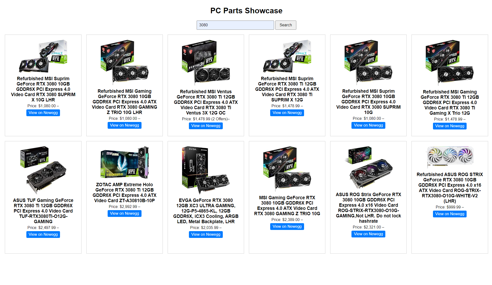

# PC Parts Showcase

PC Parts Showcase is a web application that allows users to search for PC parts on Newegg and display the results along with images fetched from Amazon using the SearchAPI.

## Features

- Search for PC parts on Newegg
- Display product name, price, and URL
- Fetch and display product images from Amazon using the SearchAPI
- Save searched products to a MySQL database for faster retrieval

## Installation

1. Clone the repository:

   ```
   git clone https://github.com/Keekay-OD/pc-parts-showcase.git
   ```

2. Navigate to the project directory:

   ```
   cd pc-parts-showcase
   ```

3. Create a virtual environment (optional but recommended):

   ```
   python -m venv env
   source env/bin/activate  # On Windows, use `env\Scripts\activate`
   ```

4. Install the required dependencies:

   ```
   pip install -r requirements.txt
   ```

5. Set up the MySQL database:
   - Create a new database named `pcparts`
   - Update the `SQLALCHEMY_DATABASE_URI` in `app.py` with your MySQL credentials

6. Obtain a SearchAPI key:
   - Sign up for a free account at [SearchAPI](https://www.searchapi.io/)
   - Replace `'YOUR_API_KEY_HERE'` in `scrape_searchapi` function with your actual SearchAPI key

7. Run the application:

   ```
   python app.py
   ```

   The application will be running at `http://10.0.0.48:5000/`.

## Usage

1. Open the application in your web browser.
2. Enter a search query for the PC part you're looking for in the search box.
3. The application will display the search results, including the product name, price, URL, and the corresponding image fetched from Amazon.

## Screenshots

### Search Page


### Search Results



## Contributing

Contributions are welcome! If you find any issues or have suggestions for improvements, please open an issue or submit a pull request.

## License

This project is licensed under the [MIT License](LICENSE).

## Acknowledgments

- [Newegg](https://www.newegg.ca/) for providing the product data
- [SearchAPI](https://www.searchapi.io/) for the Amazon product image search functionality